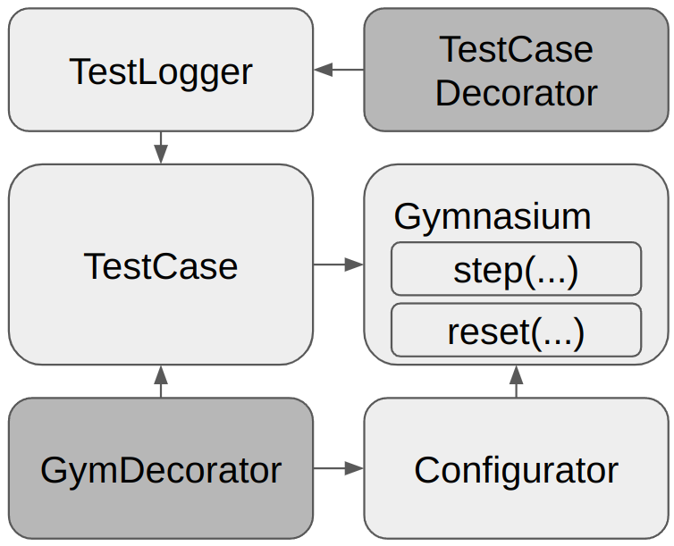
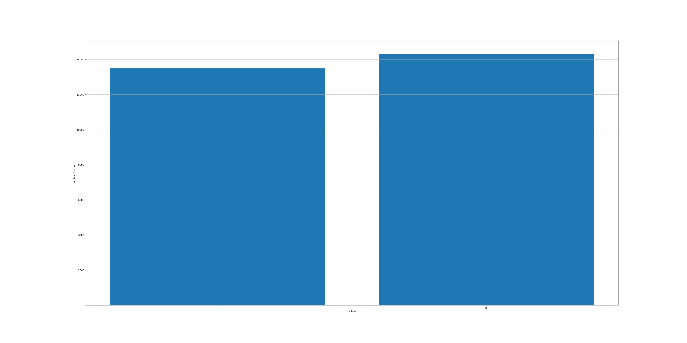
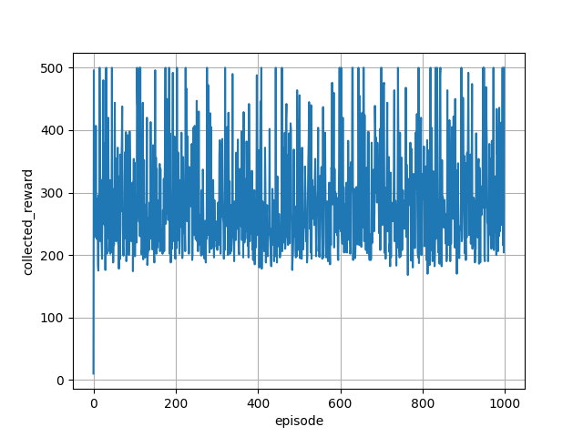
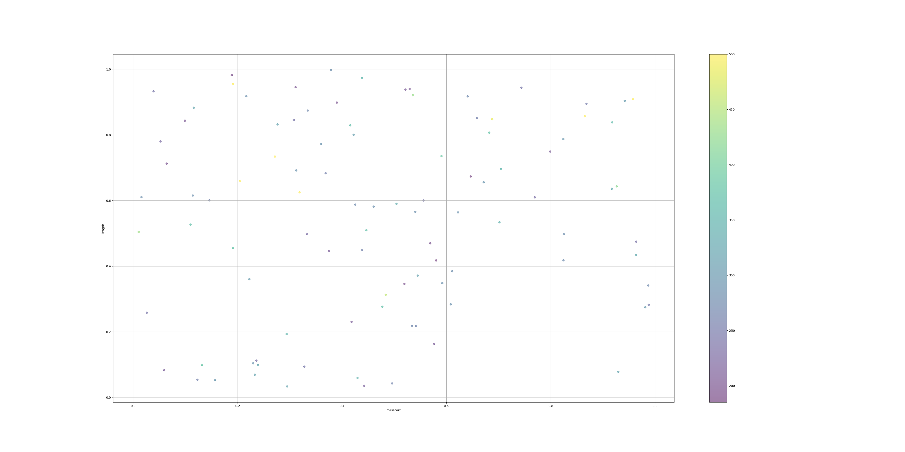
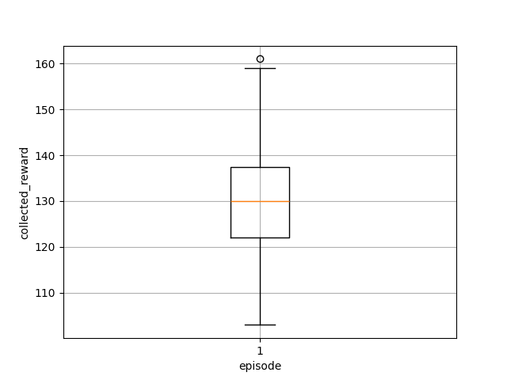

# Gimitest
The _Gimitest framework_ enhances the [Farama Gymnasium](https://gymnasium.farama.org/index.html) by modifying its `reset(...)` and `step(...)` methods, thereby simplifying the testing process of Reinforcement Learning (RL) agents at specific time steps and episode terminations, whether in training or testing phases.
It offers predefined `TestCase` classes along with the capability to develop custom ones, thereby providing flexibility in the testing regime.
The availability of both standard and customizable `Configurator` classes further enables the sampling of RL agent behavior under varied initial states and environment parameters.


## 🚀 Getting Started
Install package via:
`pip install git+https://github.com/DennisGross/gimitest.git`

The example code snippet demonstrates how to set up a basic environment, using the 'CartPole-v1' environment as an example.
First Initialize the Gym Environment: Utilize the gym.make() function from the Gymnasium package to create your environment.
Second, create a list of test cases using the `TestCase` class to define the conditions under which your RL agent will be evaluated.
Third, utilize the `Configurator` class to set initial conditions, such as state variables.
Fourth, the state variable needs to be specified via the parameters and needs to be available as attribute in the environment. In our case, the state is stored in the state variable `state`.
Fifth, the GymDecorator class is employed to extend the `reset(...)` and `step(...)` methods of the Gym environment, allowing for testing at specific time intervals and episode terminations.
Then, the decorated environment can then be executed to evaluate the RL agent's performance.
```
import gymnasium as gym
from gimitest.gym_decorator import GymDecorator
from gimitest.test_cases.test_case import TestCase
from gimitest.configurators.configurator import Configurator

# Init Gym
env = gym.make('CartPole-v1')
# List of Test Cases
test_cases = [TestCase()]
# Configurator
configurator = Configurator({"state_variable_name": "state"})
# Decorate the environment by extending its reset and step function
env = GymDecorator.decorate_gym(env, test_cases, configurator)

# Run the environment
state, info = env.reset()   # Tests and configuration are executed here
for _ in range(1000):
    action = env.action_space.sample()
    state, reward, done, truncated, info = env.step(action) # Tests are executed here
    if done or truncated:
        state, info = env.reset() # Tests and configuration is executed here
```

For more advanced examples, we refer to the examples folder.

## 👩🏼‍💻 Architecture
Decorator design pattern is used to modify the functionality of an object at runtime. At the same time other instances of the same class will not be affected by this, so individual object gets the modified behavior.

We use the decorator design pattern to extend the `reset(...)` and `step(...)` methods of the Gym environment, allowing for testing at specific time intervals and episode terminations.

In the case of `reset(...)`, the decorator checks the current state of the environment and compares it to the test cases. It then executes the basic functionality of the `reset(...)` method.
After that, it executes the configurator to either modify the initial state or modify any other parameter (such as the gravity of the environment) and returns the modified state with the corresponding information.
The TestCases can inform the configurator via messages about their execution and guide the configuration.
The following code snippet shows the implementation of the `reset(...)` decorator.
It first executes the test cases and stores their messages.
Then, it calls the original `reset(...)` function and stores the next state.
Finally, it applies the configurator if set and returns the modified state with the corresponding information.
```
def wrapper(*args, **kwargs):
    test_case_messages = []
    # Handle test cases if any
    if test_cases is not None:
    for test_case in test_cases:
        test_case.episode_execute()
        test_case_messages.append(test_case.get_message())
        test_case.episode_store()

    # Call the original reset function
    next_state, info = original_reset_function(*args, **kwargs)
    env.tmp_storage_of_state = next_state

    # Apply configurator if set
    if configurator is not None:
        env.tmp_storage_of_state = configurator.configure(env, test_case_messages)
    return env.tmp_storage_of_state, info
```

In the case of `step(...)`, the decorator checks the current state of the environment and compares it to the test cases. It then executes the basic functionality of the `step(...)` method.
The last element in the test_cases list can be used to modify the observed state for the RL agent. This can be used to test the effect of sensor noise on the RL agent's performance.

```
def wrapper(*action_args, **kwargs):
    # Call the original step function
    original_next_state, original_reward, original_done, original_truncated, original_info = 
    original_step_function(*action_args, **kwargs)
            
    # Handle test cases if any
    if test_cases is None:
        env.tmp_storage_of_state = original_next_state
        return original_next_state, original_reward, original_done, original_truncated, original_info
    else:
        for test_case in test_cases:
            tmp_next_state, tmp_reward, tmp_done, tmp_truncated, tmp_info = test_case.step_execute(env, 
            env.tmp_storage_of_state, action_args, original_reward, original_done, original_truncated,
            original_info)
            test_case.step_store()
        env.tmp_storage_of_state = original_next_state
        return tmp_next_state, tmp_reward, tmp_done, tmp_truncated, tmp_info
```

Additionally to to the gymnasium decorator, we use a test case decorator to extend the TestCase methods with the capability to store and load data via a logger.
We can see the decorator design pattern in the following diagram.
The dark gray boxes represent the decorators.
The `TestCaseDecorator` uses a `TestLogger` to extend the functionality of the `TestCase` class.
The `GymDecorator` uses the `Configurator` and/or `TestCase` to extend the functionality of the `step(...)` and `reset(...)` methods of the Gym environment.



### 👮🏼‍♂️ TestCase Class
The `TestCase` class serves as a base class for creating test cases specifically tailored for gym environments. It contains a single attribute, parameters, which is a dictionary meant for holding custom parameters for individual test cases. The class has various methods that can be overridden to provide custom behavior during testing. The `__init__(...)` method initializes the class instance with these custom parameters. The `step_execute(...)` method is designed to be called at each step in the gym environment, taking various arguments like current state, action arguments, and original outcomes like next state and reward. It returns potentially modified versions of these outcomes. The `step_store(...)` and `step_load(...)` methods are placeholders for storing and loading data relevant to each step, respectively. Similarly, `episode_execute(...)`, `episode_store(...)`, and `episode_load(...)` methods serve as placeholders for operations at the start and end of each episode. Lastly, the `get_message(...)` method is designed to return messages or information as a dictionary to inform the configurator about the execution of the test case.


#### 📝 TestLogger Class
The `TestLogger` class serves as a utility for handling the storage and retrieval of test results. It is designed to manage file operations, such as creating folders and storing data, in a structured format within a root directory specified at initialization. The class offers methods for both storing and retrieving episode-specific information as well as step-specific data within each episode. The storage methods use JSON for meta-data and Pickle for complex objects like states and actions. Additionally, the class provides a method to delete the test folder, thereby cleaning up the stored data. The class ensures that the file structure is organized according to episodes and steps, making it easier to navigate and analyze test results. Overall, this class encapsulates the file I/O operations needed for effectively managing test data in an organized manner.

It is possible to decorate `TestCase` instances with `TestLogger` instances to enable the storage of test results.

#### 📊 TestAnalyse Class
The `TestAnalyse` class serves as a utility for analyzing the test logs.
It allows to aggregate the test results over multiple episodes of a specific test case and more.


### 👨🏼‍🔧 Configurator Class
The `Configurator` class is a foundational class intended to configure gym environments.
It has a single attribute, parameters, a dictionary expected to contain custom configuration parameters including a key for "state_variable_name" which indicates the name of the state variable in the gym environment. The `__init__(...)` method initializes the object with given parameters, expected to contain a key for "state_variable_name".
The `set_attribute(...)` method alters the attribute of the gym environment based on the parameters.
the `get_attribute(...)` method etrieves the current state of the gym environment.
The `configure(...)` method is intended for overriding to provide custom environment configuration logic.


### 📨 Communication Between TestCase and Configurator
The communication between the `TestCase` and `Configurator` classes is based on messages and is done in the reset method of the `Gym` class.
The `TestCase` class can send messages to the `Configurator` class via the `create_message(...)` method.
The `Configurator` class can receive messages from the `TestCase` class via the `configure(...)` method and send messages to the `TestCase` class via the `create_message(...)` method.

The `TestCase` send first the message and receives the corresponding message from the `Configurator` in the end of the episode.
This allows us to control the configuration of the environment based on the test case execution.
<<<<<<< HEAD


## Use Cases
The following use cases demonstrate the capabilities of the Gimitest framework.


### CartPole Balancing: A Study in Reinforcement Learning Control
The full code can be found in examples/cartpole_balancing.py.

This use case explores the potential of the Gimitest framework in the realm of the CartPole environment, a standard benchmark in OpenAI's Gym toolkit for developing and comparing reinforcement learning algorithms. The objective of the CartPole task is to balance a vertically standing pole on a horizontally moving cart.

In this scenario, a Reinforcement Learning (RL) agent is tasked with controlling the cart. The agent receives the current state of the system as its input, which includes variables such as the cart's position, the pole's angle relative to vertical, and their respective velocities. Based on this input, the RL agent outputs an action, which involves moving the cart either to the left or to the right.


#### RL Training
The training phase involves optimizing the deep RL agent's policy to maximize the accumulated reward over time. This serves as an indicator of how well the agent has learned to manage the control problem of balancing the pole on the moving cart. 
The average reward over 100 evaluation episodes for the trained RL agent is 282.53.

#### RL Testing
The Gimitest framework can be used to test the RL agent in the following scenarios:
1. Test the RL agent under different initial positions.
2. Test the RL agent under different pole conditions.
3. Test the RL agent with different sensor noise.
4. Test the RL agent with abrupt environment changes.


##### Test RL agent under different initial positions
The RL agent is trained to balance the pole on the cart starting from the initial position of the pole being upright and the cart being at the center of the track. However, the RL agent may not be able to balance the pole if it is placed in a different initial position. The Gimitest framework can be used to test the RL agent's performance under different initial positions.

The following figure shows the action distribution over 1000 episodes for the RL agent under different initial positions.
The balanced action distribution indicates in the cartpole environment a well trained RL agent.



The following figure shows the reward of the RL agent under different initial positions over 500 episodes.
We see that for most of the initial positions, the RL agent is able to balance the pole on the cart with roughly the same performance.


##### Test RL agent under different cart masses and pole lengths
The RL agent is trained to balance the pole on the cart with a specific mass and pole length. However, the RL agent may not be able to balance the pole if the cart mass or pole length is changed. The Gimitest framework can be used to test the RL agent's performance under different cart masses and pole lengths.

The following figure shows the reward of the RL agent under different cart masses and pole lengths.
We can see the regions where the RL agent is able to balance the pole on the cart better (lighter color) than in other regions (darker color).




##### Test the RL agent with different sensor noise
The RL agent is trained to balance the pole on the cart with perfect sensor readings. However, the RL agent may not be able to balance the pole if the sensor readings are noisy. The Gimitest framework can be used to test the RL agent's performance under different sensor noise.

In the following figure, we can see the reward of the RL agent under different sensor noise. In comparison to the RL training average reward of 282, we can see that the RL agent's performance decreases with sensor noise.




##### Test the RL agent with abrupt environment changes
The RL agent is trained to balance the pole on the cart with a specific environment. However, the RL agent may not be able to balance the pole if the environment changes abruptly. The Gimitest framework can be used to test the RL agent's performance under different environment changes.


##### RL Retraining
The Gimitest framework can be used to retrain the RL agent based on the test results by letting the RL agent train during the testing.
=======
>>>>>>> 23723d67d7e0dc6b5b860d8ef577bf281d845bc5
